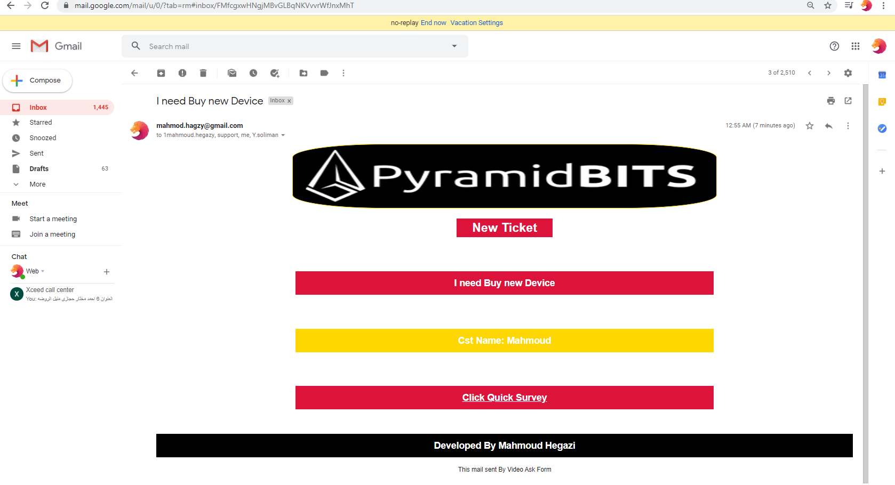

## This is Merge Between IT and web development (1 task zapier 6 actions)

## This all full Free Open source 

# result:

I used 3 APPs , API to get this result, zaiper, NG-desk, video ask

this is a tickt system created on NG desk server, and emped <a hre="https://videoask.com/">Video Ask</a> code
into my company website, user can submit ticket while he see video 
describe the options then he can select a problem or request from 12 option
it's full respsonive , then it go to next step submit a form with his name and email
this form will collect this info and with my edit to <a  href="https://zapier.com/">Zaiper</a>
it will send mail with <strong>customized HTML and with it a <a href="https://docs.google.com/forms/d/e/1FAIpQLSepNKr7ERrqBT0HaDMgGq4ljXDsM7gUCnzXVCcvFUu3Evu7vw/viewform?usp=sf_link">
The survey</a> I created on google forms 

## now we come to the hacker marge  (Out of box)

(zaiper not support NG-desk , so I connected video-ask to gmail
and i edit the gmail to let it  send it mail to my NG-desk Ticket server, and I edited
NG-desk when it recive email like that collect the data and create new ticket in NG-desk sysytem

finaly send mail to  3 :
1-(me the developer and Admin to this system cus I created and they are IT not coders)
2-My Boss
3 https://techmahmoud.ngdesk.com/ (my ticket system server)

##### I included Survey in the sendt mail on the mail sent to customer 

# How-to-emped-survey-form-to-ng-Desk
add a survey form to mail and send it using triggers feat ear at NG-desk 

#### I'm so fucking strong Who Can do that 0 becuase Zaiper not support ng -desk plus I did this Full free with only 1 task with zaiper

1.  send mail to ng desk
2.  send mail to me 
3.  send surevy
4.  create new ticket

